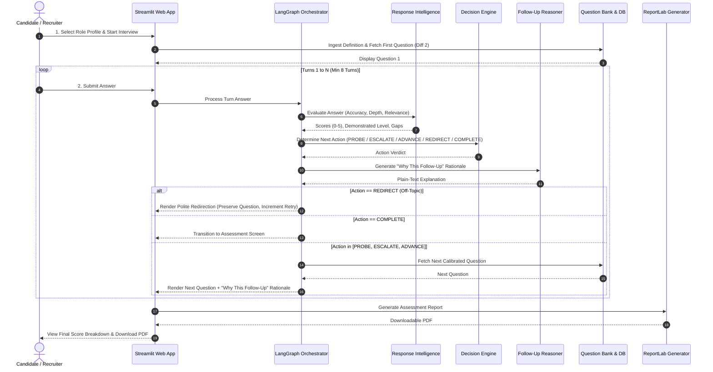

# 🔄 Adaptive Interview Workflow

The **Adaptive Interview Simulator (AIS)** orchestrates an intelligent, multi-turn interview lifecycle that replaces rigid question scripts with evidence-driven dynamic adaptation.

---

## 1. End-to-End Interview Lifecycle



---

## 2. LangGraph State Machine Graph

The core interview loop is executed via a compiled LangGraph cyclic state graph:

```text
                     +-----------------------+
                     |   evaluate_response   |
                     +-----------------------+
                                 |
                                 v
                     +-----------------------+
                     | make_adaptive_decision|
                     +-----------------------+
                                 |
                                 v
                     +-----------------------+
                     |generate_follow_up_reas|
                     +-----------------------+
                                 |
                     [ Conditional Router ]
                                 |
        +------------+-----------+-----------+------------+
        |            |           |           |            |
        v            v           v           v            v
    [ PROBE ]   [ ESCALATE ] [ ADVANCE ] [ REDIRECT ] [ COMPLETE ]
        |            |           |           |            |
        +------------+-----------+-----------+            v
                     |                             [ Finalize Session ]
                     v                             [ & Generate Report ]
          [ Fetch Next Question ]
                     |
                     v
           (Wait for User Input)
```

---

## 3. Five-Way Adaptive Decision Rules

| Decision Action | Condition / Trigger | System Action | Candidate Experience |
| :--- | :--- | :--- | :--- |
| **`PROBE`** | `demonstrated_level < target_level` and gaps detected | Stays on the same competency, selects a targeted follow-up probing the specific gap. | *"I noticed you mentioned caching, but what happens when cache invalidation fails?"* |
| **`ESCALATE`** | `demonstrated_level >= target_level` with strong accuracy & depth | Increases question difficulty (e.g., Level 2 ➔ Level 3/4) to test complex architecture or edge cases. | *"Excellent analysis. Let's ramp up complexity: How would you handle cross-region multi-master conflicts?"* |
| **`ADVANCE`** | Target competency evaluation criteria satisfied | Moves to the next configured competency at the initial target difficulty. | *"Great mastery on Distributed Systems. Moving forward to Database Reliability."* |
| **`REDIRECT`** | `is_off_topic == True` (e.g. non-sequitur or tangent) | Retains active question context, issues a supportive topic refocus request, and checks retry limit. | *"Your response appears unrelated to the production outage prompt. Could you clarify your approach to incident isolation?"* |
| **`COMPLETE`** | `total_turns >= min_turns (8)` AND all target competencies assessed | Finalizes assessment session and compiles multi-turn evidence into final scores and PDF. | Transitions to comprehensive score summary and downloadable assessment report. |

---

## 4. Response Intelligence Evaluation Matrix

Every candidate submission is scored across four quantitative dimensions and three qualitative signals:

```text
+-----------------------------------------------------------------------------------+
|                        RESPONSE INTELLIGENCE EVALUATION                           |
+-----------------------------------------------------------------------------------+
|  DIMENSION               | RANGE     | DESCRIPTION                                |
+--------------------------+-----------+--------------------------------------------+
|  Relevance Score         | 0.0 - 5.0 | How directly the answer addresses prompt   |
|  Depth Score             | 0.0 - 5.0 | Level of architectural & technical detail  |
|  Accuracy Score          | 0.0 - 5.0 | Correctness of technical concepts cited    |
|  Confidence Score        | 0.0 - 1.0 | Statistical confidence of evaluation       |
|  Demonstrated Level      | 1 to 5    | Evaluated seniority level (Junior to Staff)|
+--------------------------+-----------+--------------------------------------------+
|  QUALITATIVE SIGNALS                                                              |
|  - Key Strengths         | Specific technical concepts demonstrated accurately    |
|  - Knowledge Gaps        | Areas needing deeper probing or missing tradeoff logic |
|  - Off-Topic Diagnosis   | Categorization of derailment (Irrelevant / Chit-Chat)  |
+-----------------------------------------------------------------------------------+
```

---

## 5. Conversational Recovery & Anti-Loop Safeguards

To ensure a positive candidate experience and prevent infinite looping:

1. **State Preservation**: When a `REDIRECT` is triggered, the system preserves the original question and its associated competency/difficulty level.
2. **Retry Quota Enforcement**: If a candidate repeatedly submits off-topic responses (exceeding `MAX_OFF_TOPIC_RETRIES = 2`), the system records a baseline score for the question and gracefully executes `ADVANCE` to proceed rather than stalling.
3. **Supportive Tone**: Redirect prompts are phrased constructively to reduce candidate anxiety and encourage focused responses.

---

## 6. PDF Report Generation Pipeline

At the conclusion of the interview:
1. **Evidence Aggregation**: All turn scores are grouped by competency and weighted according to the job definition.
2. **Overall Score Calculation**: Computes a normalized 0.0–100.0 score matrix.
3. **ReportLab Rendering**: Synthesizes a publication-grade PDF containing:
   - Header with Candidate Name, Role Title, Date, and Duration.
   - Overall Weighted Score Badge and Seniority Evaluation.
   - Competency Breakdown Table with Target vs Demonstrated Level.
   - Categorized Strengths & Growth Areas.
   - Complete Turn-by-Turn Chronological Transcript Audit Trail.
